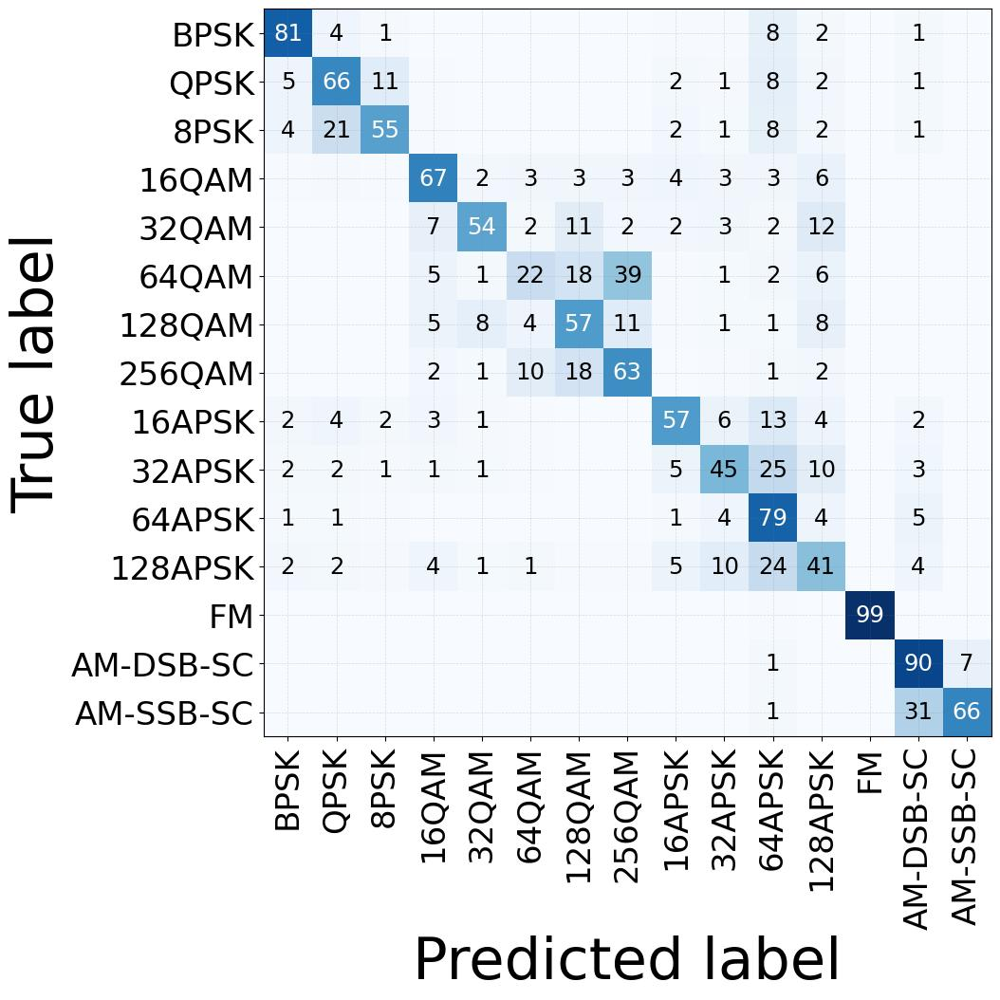
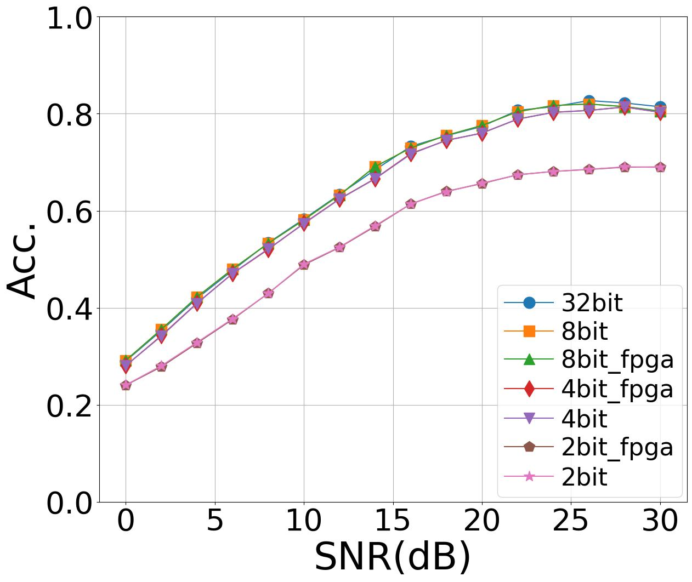

# RadioShift-ML: Train and Test Neural Networks on FPGAs for Modulation Classification 

This repository shows an example pipeline for:
- Training quantized NN using Pytorch and Brevitas
- Using FINN to generate the hardware implementation of that NN
- Implement the NN on an FPGA and run validation

## Reference
We use the source code and documents of this repository to train and test neural networks on FPGAs, which are used in the following paper.  

Anagh Mishra, Phu Le, Ryan Evans, Nirnimesh Ghose, Boyang Wang, "RadioShift: A Framework Measuing the Robustness of Lightweight Neural Networks over RF Signals," the IEEE National Aerospace and Electronics Conference (IEEE NAECON 2026), Cincinnati, OH, August 9-12, 2026, USA.

## 1. FINN Setup (run once)
```bash
cd finn && bash ./run-docker.sh
```
After docker session is finished, exit to the main directory or simply create a new terminal. 

To troubleshoot any dependencies caching issue, first try deleting the directory `finn/deps`, and run step 1 again.

## 2. Session Setup
```bash
pixi shell
```
**NOTE**: Once you are inside the pixi environment, modify the `FINN_XILINX_PATH` variable to your actual VIVADO path inside `env_example.sh`. Afterwards, source the `env_example.sh` file.

```bash
source env_example.sh
```

## 3. Dataset 
Firstly, create a directory called `dataset` to contain any relevant h5 dataset.

Internally, the pipeline have a few assumptions about the dataset that need to be checked:

1. The dataset is formatted as h5 format
2. There must be at least 2 categories (with each categories must have the same length = `frame_count`):
    - `IQ`  : hold an array of frames with shape (`frame_count`,1024,2). Each index is an I/Q frame with 1024 samples with 2 values for I and Q
    - `Mod` : hold a 1D array of respective modulation label in parallel with IQ array 
    - `SNR` (OPTIONAL) : hold a 1D array of respective SNR label in parallel with IQ array  
3. The dataset IQ values must be in INT8. Otherwise create a script to convert that dataset to INT8 beforehand
4. The frame indices must be sorted into equal chunks. Every (modulation + SNR) combination must be equal and stacked next to each other. Preferably, sort modulation first and SNR second. The number of frames per each (modulation + SNR) combination is called `chunk_length`.
```python
# For example, dataset has 15 modulations, 16 SNRs
# There are 4096 frames per modulations + snrs combination
snr_count = 16
chunk_length = 4096

# To get the index of a frame at:
# (modulation,snr,sample) = (4,5,600)
mod_index = 4
snr_index = 5
sample_index = 600

iq_index = mod_index * snr_count * chunk_length 
            + snr_index * chunk_length
            + sample_index
```

To load a dataset, use the `dataset_utils.py` as an example below:

```python
from src.dataset_utils import radio_dataset

dataset = radio_dataset(
    dataset_path="path/to/dataset.h5",
    iq_key="all_IQ_8bit",
    mod_key="all_labels",
    snr_key="all_SNRs", #OPTIONAL, use None if not available
    chunk_length=4096, #as explained above
)

# OPTIONAL, if you have an array of test indices
# and want to stay consistent between runs
# Example new_test_indices=[99,44,55,23,4356,...]
dataset.load_external_test_indices(new_test_indices)
```
In certain dataset, the labels are sometimes not in consecutive order. For example, the labels inside the RF_Captured dataset has `labels = [0,1,2,12]` (we want to keep FM=12 consistent). Using these labels directly is not possible with Pytorch. Internally, our dataset wrapper automatically detects this and generates an index mapping `[0,1,2,12] <-> [0,1,2,3]`. This mapping can be found in `model_output_mapping.json` when running training in the next step.

## 4. Run Training
This stage is found in the `run_train.py`, and used to run training models on a dataset. These models are stored as checkpoints whenever their test accuracy increases.


Before running the `run_train.py` script, change these parameters below to your actual settings in the `main()`. For example:
```python
#Example training on Rayleigh PPM20 dataset

# PARAMETERS
# All models can be found in build_dir
num_epochs = 10
build_dir = "runs/train_on_ray_ppm20"
os.makedirs(build_dir, exist_ok=True)

dataset = radio_dataset(
    dataset_path="dataset/MatGenData_ppm20_rayleigh_int8_20260204.h5",
    iq_key="all_IQ_8bit",
    mod_key="all_labels",
    snr_key="all_SNRs",
    chunk_length=4096,
)
```

```bash
python3 .src/run_train.py
```
Only the parameters of the model is saved as the `.pth` file. To load back the model, instantiate the pytorch module first, and load the `.pth` back.

## 5. Run Testing and Visualizing Results
Assuming that full training run is used above. This stage is found in the `run_generate_test_result.py` and has two main functions:
- `generate_raw_test_result()`: Generate the `testing_result` object, which store `ypred`, `y_true`, and optionally `ysnr`. These are then serialized into `.npz` file.
- `generate_pretty_plots()`: Load the `.npz` files and generate the result visualizations.

Before running the `run_generate_test_result.py` script, change these parameters below to your actual settings in the `main()`. For example:

```python
#the directory that were previously used for training
build_dir = "runs/train_on_ray_ppm20"

#where to save the results
result_path = build_dir+"/test_on_ray_ppm20"

# OPTIONAL
# mapping the index to the actual modulation name 
# for plotting. If not available, mod_classes can be None
mod_classes = ["BPSK", 
            "QPSK", 
            "8PSK",
            "16QAM",
            "32QAM", 
            "64QAM", 
            "128QAM", 
            "256QAM",
            "16APSK", 
            "32APSK", 
            "64APSK", 
            "128APSK",
            "FM", 
            "AM-DSB-SC", 
            "AM-SSB-SC"]

# ── Dataset ──────────────────────────────────────────────────────────────
dataset = radio_dataset(
    dataset_path = "dataset/MatGenData_ppm20_rayleigh_int8_20260204.h5",
    iq_key = "all_IQ_8bit",
    mod_key = "all_labels",
    snr_key = "all_SNRs",
    chunk_length = 4096,
)
```

```bash
python3 .src/run_generate_test_result.py
```

## 6. Run FINN
After running training in section 4, the quantized models are also converted into a QONNX file (extension `.onnx`). These QONNX can go through the FINN pipeline inside the `run_finn.py` script.

**NOTE**: This FINN pipeline assumes that you are using the VGG10 model architecture. The pipeline may need to be modified if different NN architecture is used.

**NOTE**: Ensure that `FINN_XILINX_VERSION` and `FINN_XILINX_PATH` are correct as FINN require VIVADO API. To check, run these commands in your terminal:
```bash
echo $FINN_XILINX_VERSION # This should be your VIVADO version
echo $FINN_XILINX_PATH # Path to your Vivado
```

Before running the `run_generate_test_result.py` script, change the `build_dir` in the `main()` to your actual path. For example:
```python
build_dir = "runs/train_on_ray_ppm20" #where all your models are
```

```bash
python3 .src/run_finn.py
```

Because FINN pipeline needs to be run inside the FINN Docker container, the `run_finn.py` actually does not do the heavy lifting, but rather just create the Docker container, copy all the QONNX files inside and call another script inside to run the pipeline. The result `.bit`, `.hwh` and `VIVADO stitched_ip` are then copied back to the directory outside. To learn more about the pipeline, you can view the `finn_deploy.py` inside `src/finn_custom_build/`

The stitched IP project `.xpr` file can be viewed inside VIVADO. The project will include a Verilog module corresponding to the NN. However, they still reference several dependencies generated in `finn_custom_build/tmp`. This can accumulate over time if you have multiple runs. If you wish to clean the `tmp/` folder, ensure all your relevant stitch IP projects are achived in VIVADO to move these dependencies into their own archive. 

## 7. Run Testing on FPGA
After running FINN, all generated files are located inside `[build_dir]/[model]/finn_build_dir/[FPGA_platform]/`

For implementing on FPGA, we only need the `.bit` and `.hwh` files inside the `bitfile/`. 

If this is your first run, copy the `example_driver/` directory inside `src/fpga_deploy/example_driver/` to your FPGA (with PYNQ already setup). Then copy your `.bit` and `.hwh` files into a dedicated folder inside `example_driver/bit_files`. 

Afterwards, follow the [`example_driver/README.md`](src/fpga_deploy/example_driver/README.md) tutorial to gather all the testing result `.npz` files, and copy them back to the PC host to visualize their result.

## 8. Run Visualizing Results with FPGA result
Once all FPGA testing result are generated and saved as `.npz`, copy them back to the result path that you specified earlier. Now you should have all testing result `.npz` for 32, 8, 4, 2 bits (each has their GPU and FPGA version except for 32bits).

Run the `run_generate_test_result.py` again, and you should see the accuracy report for each models.

```bash
python3 .src/run_generate_test_result.py
```

## Example Result 
The figures below are the result from running the pipeline on the dataset Rayleigh-PPM20. Each models were trained for 10 epochs.

### Overall Accuracy
```bash
runs/train_on_ray_ppm20/test_on_ray_ppm20/32bit.npz
ACC OVERALL:  0.6450794621026895
ACC >=6dB:  0.7121685160804965
ACC ==30dB:  0.8143439282803586

runs/train_on_ray_ppm20/test_on_ray_ppm20/8bit.npz
ACC OVERALL:  0.6442542787286064
ACC >=6dB:  0.7107015234154599
ACC ==30dB:  0.8052159739201304

runs/train_on_ray_ppm20/test_on_ray_ppm20/8bit_fpga.npz
ACC OVERALL:  0.6443459657701711
ACC >=6dB:  0.7107266002131528
ACC ==30dB:  0.8055419722901386

runs/train_on_ray_ppm20/test_on_ray_ppm20/4bit_fpga.npz
ACC OVERALL:  0.6329563977180114
ACC >=6dB:  0.6995674252397969
ACC ==30dB:  0.8029339853300733

runs/train_on_ray_ppm20/test_on_ray_ppm20/4bit.npz
ACC OVERALL:  0.6328035859820701
ACC >=6dB:  0.6994545796501787
ACC ==30dB:  0.8030969845150774

runs/train_on_ray_ppm20/test_on_ray_ppm20/2bit_fpga.npz
ACC OVERALL:  0.5352485737571312
ACC >=6dB:  0.5936555701836875
ACC ==30dB:  0.6903015484922576

runs/train_on_ray_ppm20/test_on_ray_ppm20/2bit.npz
ACC OVERALL:  0.535757946210269
ACC >=6dB:  0.5939941069525422
ACC ==30dB:  0.6894865525672371
```
### Confusion Matrix of 4 bit Model Validation on FPGA (Over All SNR)


### Accuracy over SNR of All Models

